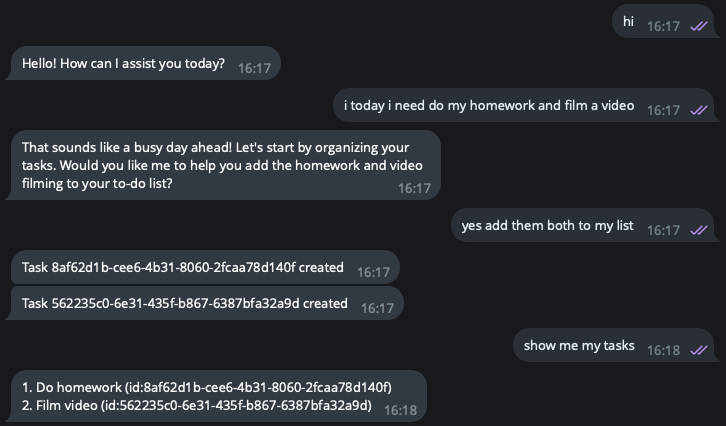
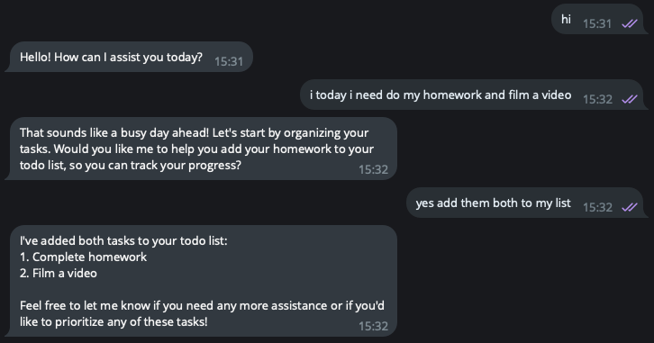

**Project AI DIARY APP details**
-

ChatGPT's OpenAI integration in Telegram for AI brain and user accessibility!

Motivation
-

Many people (me included) have a hard time with time management and motivation, so AI DIARY bot can help with organising tasks
and helping in tough situations.

Project development
-

| **Task**                        | **Deadline** | **Status**              | Urgency       |
|---------------------------------|--------------|-------------------------|---------------|
| Update UML diagram              | 19.03        | :ballot_box_with_check: |               |
| Create telegram bot             | 20.03        | :ballot_box_with_check: |               |
| Set up database dependency      | 24.03        | :ballot_box_with_check: |               |
| Create dispatcher               | 07.04        | :ballot_box_with_check: |               |
| User friendly function response | 28.04        | in progress             | :exclamation: |
| User registration process       | 14.05        | in progress             |               |
| Voice recognition               | 21.05        | upcoming                |               |
| Photo recognition               | 28.05        | upcoming                |               |

AI DIARY tasks before and after update
- 
Before

After

Future ideas
-
- Questionnaire for personalized conversation
- Calorie count from photo of a meal
- Voice message option

Documentation
- 
- Programming language: Java
- Framework: Spring Boot
- API reference [OpenAI API](https://platform.openai.com/docs/api-reference/introduction)

